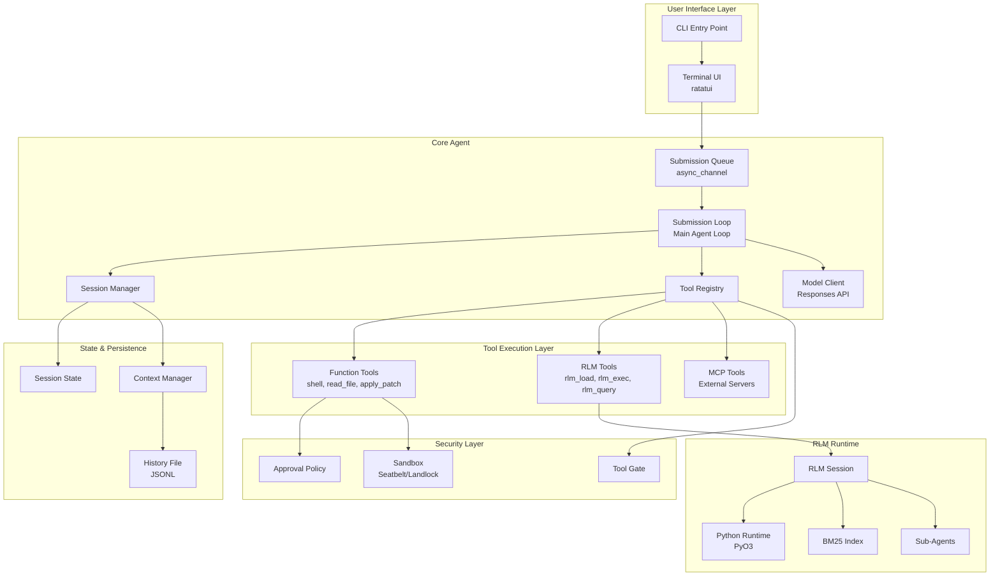

# RLM: Recursive Language Model Runtime

**Status:** Draft v0.8
**Vision:** Give agents the ability to process contexts of any size
**Based on:** [Recursive Language Models](https://arxiv.org/abs/2512.24601) (arXiv:2512.24601)

---

## Quick Reference

```
TOOLS
  rlm_load(path)              Load context (resets session)
  rlm_load_append(path)       Add to context (preserves state)
  rlm_exec(code, limits?)     Run Python, return result_json + result_meta
  rlm_query(prompt)           Quick scan+summarize (read-only, no Python)
  rlm_helpers_add(name,code)  Define helper function
  rlm_helpers_list()          List helpers
  rlm_helpers_remove(name)    Remove helper
  rlm_memory_put(key,value)   Store JSON (overwrites)
  rlm_memory_get(key)         Retrieve JSON
  rlm_memory_batch(ops)       Batch put/get operations
  rlm_memory_list()           List keys
  rlm_memory_clear()          Clear all

BUILTINS (available in rlm_exec)
  P                           The loaded context string
  peek(start, end)            View slice of P
  find(pattern, flags?)       Regex search → {"matches": [...], "capped": bool}
  search(query, k=10)         BM25 search → [{"text","score","start","end"},...]
  llm_query(prompt, tools?)   Spawn sub-agent → response string
  llm_query_batch(prompts)    Sub-agents → {"results": [...], "execution_mode": "..."}
  peek_doc(doc_id,start,end)  View slice within specific document
  session()                   Full session manifest (sources, helpers, memory keys, budget)
  stats()                     Context info → {"chars","tokens","lines","docs","sources","context_hash"}
  limits()                    Current execution limits
  budget()                    Remaining budget → {"tokens","sub_calls","time_ms"}
  find_routes(topic)          Search AGENTS.md routing
  list_docs(prefix?)          List documents

RETURN STRUCTURED DATA
  result = {"key": value}     → returned as result_json
  result_meta = {"page": 1}   → returned as result_meta (optional)
```



---

## Executive Summary

RLM enables language models to process contexts orders of magnitude beyond their native window by treating the context as **data in an environment** rather than input to the model. The model programmatically inspects, decomposes, and recursively processes the context through an embedded Python interpreter.

**The core capability:** The agent can write Python code with special builtins (`peek`, `find`, `llm_query`, etc.) to explore arbitrarily large contexts, plus define session helpers and retain working memory across passes.

---

## Table of Contents

1. [Core Concepts](#1-core-concepts)
2. [Architecture](#2-architecture)
3. [Tool Interface](#3-tool-interface)
4. [Python Builtins](#4-python-builtins)
5. [Lifecycle & State Management](#5-lifecycle--state-management)
6. [Safety & Sandboxing](#6-safety--sandboxing)
7. [Budget & Recursion Limits](#7-budget--recursion-limits)
8. [Error Taxonomy](#8-error-taxonomy)
9. [Concurrency & GIL Strategy](#9-concurrency--gil-strategy)
10. [Common Patterns](#10-common-patterns)
11. [Integration with Codex](#11-integration-with-codex)
12. [Implementation Status](#12-implementation-status)

---

## 1. Core Concepts

### 1.1 The Fundamental Insight

Traditional LLMs treat the prompt as **input** — it must fit in the context window. RLM treats the context as **environment** — an external data store the model can programmatically explore.

```
Traditional:  context → [  LLM  ] → response
                        (must fit)

RLM:          context → [ Store ] ← inspect/query ← [  LLM  ] → response
                       (any size)    (Python code)   (small window)
```

### 1.2 Why Python?

The paper's key finding: letting the model **write code** to inspect context dramatically outperforms fixed tool APIs. The model can:

- Craft precise regex patterns for the specific task
- Implement custom chunking strategies
- Build up intermediate data structures
- Adapt inspection strategy based on findings

### 1.3 Recursive Decomposition

Complex queries decompose into sub-queries processed by sub-agents:

```
"What are the top 3 bugs in this codebase?"
    │
    ├─→ "Find all error handling patterns" ──→ sub-agent
    ├─→ "Identify inconsistencies" ──→ sub-agent
    └─→ "Rank by severity" ──→ sub-agent
            │
            └─→ Final synthesis by main agent
```

---

## 2. Architecture

### 2.1 System Overview

```
┌─────────────────────────────────────────────────────────────────────────────┐
│                              Codex Agent                                     │
│                                                                              │
│  Existing Tools: shell, read_file, apply_patch, web_search, ...             │
│                                                                              │
│  RLM Tools:                                                                  │
│  ┌─────────────────────────────────────────────────────────────────────┐    │
│  │  rlm_load(path)        → Load context, returns stats                │    │
│  │  rlm_load_append(path) → Append context, preserves state            │    │
│  │  rlm_exec(code)        → Execute Python, returns structured result  │    │
│  │  rlm_query(prompt)     → Quick workflow (read-only, no Python)      │    │
│  │  rlm_helpers_*         → Session helper management                  │    │
│  │  rlm_memory_*          → Session memory for multi-pass workflows    │    │
│  └─────────────────────────────────────────────────────────────────────┘    │
│                                    │                                         │
│                                    ▼                                         │
│  ┌─────────────────────────────────────────────────────────────────────┐    │
│  │              RlmSession (one per agent session)                      │    │
│  │                                                                      │    │
│  │  Context: P (loaded string)                                         │    │
│  │  Sources: ["/path/a", "/path/b", ...]                               │    │
│  │  Helpers: {name → code} (insertion order preserved)                 │    │
│  │  Memory: {key → value} (JSON, overwrite semantics)                  │    │
│  │  Budget: {tokens, sub_calls, time_ms}                               │    │
│  └─────────────────────────────────────────────────────────────────────┘    │
│                                    │                                         │
│                                    ▼                                         │
│  ┌─────────────────────────────────────────────────────────────────────┐    │
│  │                         AgentControl                                 │    │
│  │  llm_query() spawns sub-agents (scoped tools, shared budget)        │    │
│  └─────────────────────────────────────────────────────────────────────┘    │
└─────────────────────────────────────────────────────────────────────────────┘
```

### 2.2 Key Design Decisions

1. **Embedded Python, not subprocess** — PyO3 embeds Python for low latency and direct callbacks.

2. **Agent writes Python** — The main agent writes Python code using builtins. No hidden LLM loop.

3. **One RlmSession per agent session** — Context and state persist across `rlm_exec` calls, cleaned up on session end.

4. **Scoped sub-agents** — `llm_query()` spawns sub-agents with reduced tool access by default. Tool scope can be expanded via policy-gated override.

5. **Structured output + metadata** — Tools return JSON with `result_json` for data and `result_meta` for pagination/truncation info.

---

## 3. Tool Interface

### 3.1 `rlm_load` — Load Context

Loads a large context into the Python environment. **Resets session state.**

```json
{
  "name": "rlm_load",
  "description": "Load a large context (file or directory) for programmatic exploration. Resets all Python state, helpers, memory, and budget. Path must be absolute and within sandbox. Returns context stats.",
  "parameters": {
    "path": {
      "type": "string",
      "description": "Absolute path to file or directory"
    }
  }
}
```

**Returns:**
```json
{
  "success": true,
  "stats": {
    "length_chars": 4523891,
    "length_tokens_estimate": 1130972,
    "line_count": 89234,
    "document_count": 1725,
    "has_routing": true,
    "routing_entry_count": 362,
    "sources": ["/path/to/loaded/dir"],
    "context_hash": "a3f2e1b4c5d6789..."
  }
}
```

**Path resolution & safety:**
- Path must be absolute
- Path must be within Codex's sandbox read roots
- Symlinks resolved and validated
- Error `path_outside_sandbox` if validation fails

**Directory loading rules:**
- Recursively loads all text files (utf-8)
- Respects `.gitignore` if present
- Skips binary files, files > 10MB, total > 100MB
- Maximum 10,000 files
- Deterministic ordering: sorted by relative path
- Files joined with `\n===== {relative_path} =====\n`

**Side effects:**
- Clears all Python variables
- Clears all helpers
- Resets budget to initial values
- Clears memory

### 3.2 `rlm_load_append` — Append Context

Adds more context without resetting state.

```json
{
  "name": "rlm_load_append",
  "description": "Append additional context to the current session. Preserves Python variables, helpers, memory, and budget. Use for incremental exploration or cross-referencing multiple sources.",
  "parameters": {
    "path": {
      "type": "string",
      "description": "Absolute path to file or directory"
    }
  }
}
```

**Returns:** Same shape as `rlm_load` with updated cumulative stats.

**Behavior:**
- Same path validation as `rlm_load`
- Appends with separator: `\n\n===== APPENDED: {path} =====\n\n`
- Preserves all Python state, helpers, memory
- Does **not** reset budget
- `stats.sources` array grows with each append

### 3.3 `rlm_exec` — Execute Python

Runs Python code with access to loaded context and builtins.

```json
{
  "name": "rlm_exec",
  "description": "Execute Python code to explore the loaded context. Builtins: peek, find, search, llm_query, session, stats, limits, budget, find_routes, list_docs. Set 'result' for JSON return, 'result_meta' for metadata. Variables persist across calls.",
  "parameters": {
    "code": {
      "type": "string",
      "description": "Python code to execute"
    },
    "limits_override": {
      "type": "object",
      "description": "Optional per-call limit overrides (clamped by policy)",
      "properties": {
        "max_output_bytes": {"type": "integer"},
        "max_execution_ms": {"type": "integer"},
        "max_find_results": {"type": "integer"}
      }
    }
  }
}
```

**Returns (success):**
```json
{
  "success": true,
  "stdout": "Found 42 matches\n",
  "stderr": "",
  "result_json": {"count": 42, "items": ["..."]},
  "result_meta": {"truncated_items": 100, "total_available": 142},
  "truncated": false,
  "warnings": [],
  "execution_time_ms": 234,
  "limits_applied": {
    "max_output_bytes": 102400,
    "max_execution_ms": 30000
  },
  "tool_override_events": [],
  "budget": {
    "remaining_tokens": 450000,
    "remaining_sub_calls": 45,
    "remaining_time_ms": 295000
  }
}
```

**Returns (error):**
```json
{
  "success": false,
  "error_code": "python_error",
  "error_message": "NameError: name 'x' is not defined",
  "traceback": "Traceback (most recent call last):\n  File \"<rlm>\", line 1...",
  "suggestion": "Check variable name spelling or define it before use",
  "stdout": "partial output...",
  "stderr": "",
  "warnings": []
}
```

**stdout/stderr are always present:**
- Both fields appear in success and error responses
- On success: captures any `print()` output
- On error: captures partial output before failure
- Empty string `""` if nothing was printed
```

**Return channels:**

| Variable | Field | Description |
|----------|-------|-------------|
| `result` | `result_json` | Primary structured data (must be JSON-serializable) |
| `result_meta` | `result_meta` | Optional metadata (pagination, truncation info, etc.) |

**If `result` is not JSON-serializable:**
- `result_json`: `null`
- `warnings`: `["result_not_serializable"]`

**Per-call limit overrides:**
- `limits_override` lets you request higher/lower limits for this call
- Policy clamps values to configured maximums
- `limits_applied` in response shows what was actually used
- Example: `{"max_output_bytes": 500000}` for a large extraction

**Helper injection order:**
1. Helpers injected in **insertion order** (order added via `rlm_helpers_add`)
2. Then `rlm_exec` code body executes
3. If helper names conflict with user code, user code wins (shadowing)

**Output limits:**
- stdout + stderr capped at `max_output_bytes` (default 100KB)
- If exceeded: `truncated: true`, ends with `\n[truncated]`
- This is **not** an error; `success` can still be `true`

**Warnings array (non-fatal):**
- `"output_truncated"` — stdout/stderr hit limit
- `"find_results_capped"` — find() hit max results
- `"result_not_serializable"` — result var couldn't be JSON-encoded
- `"tool_override_denied"` — requested tools not granted for llm_query

### 3.4 `rlm_query` — Convenience Tool

Quick scan-and-summarize without writing Python. **Read-only** — does not mutate helpers or memory.

```json
{
  "name": "rlm_query",
  "description": "Quick read-only analysis of loaded context without writing Python. Does NOT modify helpers or memory. Internally searches, extracts, and summarizes. Good for simple questions; use rlm_exec for complex analysis or state changes.",
  "parameters": {
    "prompt": {
      "type": "string",
      "description": "Question or task (e.g., 'find all TODO comments and categorize by urgency')"
    },
    "max_sections": {
      "type": "integer",
      "description": "Maximum sections to analyze (default: 10, max: 50)",
      "default": 10
    },
    "search_strategy": {
      "type": "string",
      "enum": ["regex", "bm25", "routing", "auto"],
      "description": "How to find relevant content (default: auto)",
      "default": "auto"
    }
  }
}
```

**Returns:**
```json
{
  "success": true,
  "answer": "Found 23 TODO comments. By urgency: HIGH (5): ..., MEDIUM (12): ..., LOW (6): ...",
  "sections_analyzed": 10,
  "search_strategy_used": "regex",
  "budget": { ... }
}
```

**Guarantees:**
- **Read-only**: Does not modify helpers or memory
- **Deterministic search**: Same prompt + context + limits = same sections searched
- **Safe to call repeatedly**: No side effects on session state
- **Uses helpers**: Can call helper functions if defined, but won't define new ones
- **Budget consumed**: Sub-agent calls decrement budget

**When to use:**
- Simple questions: "What does this codebase do?"
- Quick scans: "Find all security-related comments"
- Overview tasks: "Summarize the main modules"

**When to use `rlm_exec` instead:**
- Custom search patterns
- Multi-step analysis
- Building data structures
- Storing results in memory
- Precise control over sub-agent calls

---

## 4. Python Builtins

All builtins are implemented in Rust and injected into Python.

### 4.1 Context Inspection

| Builtin | Signature | Description |
|---------|-----------|-------------|
| `P` | `str` | The loaded context string. Read-only. |
| `peek` | `peek(start, end) → str` | View slice `P[start:end]`. Bounds clamped. |
| `peek_doc` | `peek_doc(doc_id, start?, end?) → str` | View slice within a specific document by ID. |
| `find` | `find(pattern, flags?) → dict` | Regex search. Returns `{"matches": [(start, end), ...], "capped": bool}`. Max 10k results. |

**`find` behavior:**
- Returns `{"matches": [...], "capped": bool}` instead of a raw list
- `capped: true` indicates results were truncated at the limit (default 10k)
- Uses Rust's `regex` crate under the hood (linear-time, no catastrophic backtracking/ReDoS)

**`peek_doc` behavior:**
- `doc_id`: The document ID (relative path) from `list_docs()`
- `start`, `end`: Offsets within the document (not global offsets)
- Returns empty string if document not found

**`find` flags:**
- `"i"` — case insensitive
- `"m"` — multiline (^ and $ match line boundaries)
- `"s"` — dotall (. matches newline)
- Combine: `find(r"TODO.*", "im")`

### 4.2 Search & Routing

| Builtin | Signature | Description |
|---------|-----------|-------------|
| `search` | `search(query, k=10) → list[dict]` | BM25 search. Returns `[{"text", "score", "start", "end"}, ...]`. Max k=100. |
| `find_routes` | `find_routes(topic, limit=10) → list[dict]` | Search AGENTS.md routing graph. Returns `[{"path", "description", "relevance"}, ...]`. Max 50. |
| `list_docs` | `list_docs(prefix=None) → list[dict]` | List documents in context. Returns `[{"id", "path", "size", "start", "end"}, ...]`. Max 1000. |

### 4.3 Sub-Agent Calls

| Builtin | Signature | Description |
|---------|-----------|-------------|
| `llm_query` | `llm_query(prompt, tools=None) → str` | Spawn sub-agent, block until done. Returns response string. |
| `llm_query_batch` | `llm_query_batch(prompts, max_concurrent=5) → dict` | Batch sub-agents. Returns `{"results": [...], "execution_mode": "..."}`. |

**`llm_query` behavior:**

```python
# Basic usage (reduced tool set)
response = llm_query("Summarize this code:\n" + peek(0, 5000))

# Request additional tools (requires policy approval)
response = llm_query("Fix this bug", tools=["shell", "write_file"])
```

**Default sub-agent tools:** `read_file`, `glob`, `grep` (read-only)

**Tool override (`tools` parameter):**
- If `tools` is specified, checked against session policy
- If policy allows: sub-agent gets requested tools
- If policy denies: raises `PolicyViolationError`
- Override decisions are logged in `rlm_exec` response (see below)

**`llm_query_batch` return shape:**

```python
response = llm_query_batch(["prompt1", "prompt2", "prompt3"])
# response = {
#   "results": ["response1", {"error": {...}}, "response3"],
#   "execution_mode": "sequential"  # or "parallel" when available
# }
```

- `results`: List of responses (strings) or error objects for each prompt
- `execution_mode`: How the batch was executed (`"sequential"` or `"parallel"`)

**Error objects in results:**

```python
{"error": {"code": "timeout", "message": "...", "retriable": True}}
```

Error object fields:
- `code`: Error code (`timeout`, `budget_exceeded`, `sub_agent_error`)
- `message`: Human-readable description
- `retriable`: `True` if retrying might succeed

### 4.4 Session Info & Limits

| Builtin | Signature | Description |
|---------|-----------|-------------|
| `session` | `session() → dict` | Full session manifest (see below) |
| `stats` | `stats() → dict` | Context stats only |
| `limits` | `limits() → dict` | Current execution limits |
| `budget` | `budget() → dict` | Remaining budget |

**`session()` returns complete session manifest:**

```python
{
  "sources": ["/repo/docs", "/repo/src"],
  "context_chars": 4523891,
  "context_tokens_estimate": 1130972,
  "context_hash": "a3f2e1b4c5d6...",  # SHA256 for determinism verification
  "helpers": ["analyze_chunk", "summarize_section"],
  "memory_keys": ["found_issues", "analysis_results"],
  "memory_bytes_used": 45231,
  "budget": {
    "remaining_tokens": 450000,
    "remaining_sub_calls": 45,
    "remaining_time_ms": 295000
  },
  "limits": {
    "max_output_bytes": 102400,
    "max_find_results": 10000,
    "max_execution_ms": 30000
  }
}
```

**`context_hash` for determinism:**

The `context_hash` is a SHA256 hash of the loaded context string. Use it to:
- Verify the same context is loaded for replay/debugging
- Detect if context changed between runs
- Cache results keyed by context hash

This lets you re-orient after context switches without multiple tool calls.

---

## 5. Lifecycle & State Management

### 5.1 Session Lifecycle

```
Agent session starts
        │
        ▼
rlm_load(path)  ─────────────────────────────────────────┐
        │                                                 │
        ▼                                                 │
┌─────────────────────────────────┐                      │
│ RlmSession created/reset        │                      │
│ - Context loaded into P         │                      │
│ - Python state cleared          │                      │
│ - Budget reset                  │                      │
│ - Helpers cleared               │                      │
│ - Memory cleared                │                      │
└─────────────────────────────────┘                      │
        │                                                 │
        ▼                                                 │
rlm_exec(code) ←──────────────────────────┐              │
        │                                  │              │
        ▼                                  │              │
┌─────────────────────────────────┐       │              │
│ Python executes                 │       │              │
│ - Helpers injected (insertion   │       │              │
│   order) before code runs       │       │              │
│ - Variables persist ────────────┼───────┘              │
│ - Memory accessible             │                      │
│ - Budget decremented            │                      │
└─────────────────────────────────┘                      │
        │                                                 │
        ▼                                                 │
rlm_load_append(path)                                    │
        │                                                 │
        ▼                                                 │
┌─────────────────────────────────┐                      │
│ Context extended                │                      │
│ - P grows with new content      │                      │
│ - Variables preserved           │                      │
│ - Helpers preserved             │                      │
│ - Memory preserved              │                      │
│ - Budget NOT reset              │                      │
└─────────────────────────────────┘                      │
        │                                                 │
        ├─── (continue with rlm_exec) ───────────────────┘
        │
        ▼
rlm_load(new_path)  ─────────────────────────────────────┘
        │                     (full reset, start fresh)
        ▼
Agent session ends → RlmSession dropped
```

### 5.2 Helpers

Session-scoped Python snippets that persist across `rlm_exec` calls.

**Tools:**
- `rlm_helpers_add(name, code)` — Define a helper (appends to list)
- `rlm_helpers_list()` — List helpers in insertion order
- `rlm_helpers_remove(name)` — Remove a helper

**Injection order:**
1. Helpers are injected in **insertion order** (the order they were added)
2. If two helpers define the same function, later one shadows earlier
3. User code in `rlm_exec` runs after all helpers, can shadow helper definitions

**Example:**
```python
# First helper added
rlm_helpers_add("utils", """
def chunk(text, size=5000):
    return [text[i:i+size] for i in range(0, len(text), size)]
""")

# Second helper added (runs after utils)
rlm_helpers_add("analyze", """
def analyze_chunk(start, end, question):
    chunk = peek(start, min(end, start + 5000))
    return llm_query(f"{question}\\n\\nCode:\\n{chunk}")
""")
```

**Constraints:**
- Total helper storage: 1MB max
- Helpers execute in same sandbox as user code
- Cleared on `rlm_load` (but not `rlm_load_append`)

### 5.3 Memory

Structured key-value store for multi-pass workflows.

**Tools:**
- `rlm_memory_put(key, value)` — Store JSON value (**overwrites** if key exists)
- `rlm_memory_get(key)` — Retrieve value (`None` if missing)
- `rlm_memory_batch(ops)` — Batch operations (see below)
- `rlm_memory_list()` — List keys
- `rlm_memory_clear()` — Clear all memory

**Semantics:**
- `rlm_memory_put` always **overwrites** existing values (no merge)
- For merging, read-modify-write in your code:
  ```python
  existing = rlm_memory_get("items") or []
  existing.append(new_item)
  rlm_memory_put("items", existing)
  ```

**Batch operations:**

```json
{
  "name": "rlm_memory_batch",
  "parameters": {
    "ops": [
      {"op": "put", "key": "a", "value": {"x": 1}},
      {"op": "put", "key": "b", "value": {"y": 2}},
      {"op": "get", "key": "c"},
      {"op": "get", "key": "d"}
    ]
  }
}
```

**Returns:**
```json
{
  "success": true,
  "results": [
    {"op": "put", "key": "a", "ok": true},
    {"op": "put", "key": "b", "ok": true},
    {"op": "get", "key": "c", "value": {"existing": "data"}},
    {"op": "get", "key": "d", "value": null}
  ]
}
```

**Constraints:**
- Total memory: 5MB max
- JSON values only
- Cleared on `rlm_load` (but not `rlm_load_append`)

---

## 6. Safety & Sandboxing

### 6.1 Path Containment

| Check | Enforcement |
|-------|-------------|
| Absolute path | Reject relative paths |
| Within sandbox | Must be under read-allowed roots |
| Symlink safety | Resolve and revalidate target |
| No traversal | Reject `..` after normalization |

### 6.2 Python Sandbox

**Blocked imports:**
```
os, sys, subprocess, socket, ctypes, pickle, pathlib, shutil,
signal, multiprocessing, threading, asyncio
```

**Blocked builtins:**
```
open, exec, eval, compile, __import__, input, getattr, setattr, delattr, vars
```

**AST validation:**
- Reject dunder access (`obj.__class__`)
- Reject dunder subscripts (`obj["__globals__"]`)

### 6.3 Sub-Agent Scoping & Audit

Default sub-agent tools: `read_file`, `glob`, `grep`

Sub-agents **cannot**:
- Invoke `rlm_load`, `rlm_exec`, or other RLM tools (prevents recursion)
- Use `shell` or write tools (unless policy-approved override)

**Tool override audit:**

When `llm_query(tools=[...])` is called, the decision is logged in `rlm_exec` response:

```json
{
  "success": true,
  "result_json": {...},
  "tool_override_events": [
    {
      "builtin": "llm_query",
      "requested_tools": ["shell", "write_file"],
      "granted_tools": ["shell"],
      "denied_tools": ["write_file"],
      "reason": "write_file not in allowed_tool_overrides policy"
    }
  ]
}
```

This lets you understand why sub-agents had limited capabilities without guessing.

---

## 7. Budget & Recursion Limits

### 7.1 Budget Structure

```json
{
  "max_tokens": 500000,
  "max_sub_calls": 50,
  "max_time_ms": 300000
}
```

### 7.2 Budget Semantics

**Token budget (`max_tokens`, `remaining_tokens`):**
- Counts **input + output** tokens for all sub-agent calls
- Estimated before execution, adjusted after
- Includes system prompts and tool responses

**Time budget (`max_time_ms`, `remaining_time_ms`):**
- Wall-clock time across all operations
- Includes Python execution, sub-agent calls, I/O
- Does not pause during GIL release

**Sub-call budget (`max_sub_calls`, `remaining_sub_calls`):**
- Count of `llm_query` / `llm_query_batch` invocations
- Each prompt in a batch counts as one sub-call

### 7.3 Enforcement

- `llm_query` checks budget before spawning
- Token usage estimated per call
- `BudgetExceededError` raised when exhausted
- Budget visible via `budget()` builtin and `session()` manifest

### 7.4 Recursion Prevention

- Sub-agents cannot call RLM tools
- Depth tracked; max depth = 1
- `ReentrancyError` if violated

---

## 8. Error Taxonomy

| Error Code | Meaning | Suggestion |
|------------|---------|------------|
| `context_not_loaded` | `rlm_exec` before `rlm_load` | Call `rlm_load` first |
| `path_outside_sandbox` | Path not in allowed roots | Use a path within the workspace |
| `path_not_found` | File/directory missing | Check path spelling |
| `context_too_large` | Exceeds size limits | Use a smaller directory or file |
| `python_error` | Exception in Python code | Check traceback, fix code |
| `python_timeout` | Exceeded execution time | Optimize code or increase limit |
| `sandbox_violation` | Blocked import/builtin | Use allowed APIs only |
| `budget_exceeded` | Out of tokens/calls/time | Summarize and finish |
| `cancelled` | Execution cancelled by user | Retry or end session |
| `policy_violation` | Unauthorized tool override | Remove tools parameter or request approval |
| `reentrancy_error` | Nested RLM call in sub-agent | Restructure to avoid nesting |
| `helper_limit_exceeded` | Helper storage full | Remove unused helpers |
| `memory_limit_exceeded` | Memory storage full | Clear or compact memory |

**All errors include:**
```json
{
  "success": false,
  "error_code": "...",
  "error_message": "Human-readable description",
  "suggestion": "What to do about it"
}
```

---

## 9. Concurrency & GIL Strategy

### 9.1 Execution Model

- Python runs in `tokio::task::spawn_blocking`
- GIL released during `llm_query` waits
- One `RlmSession` per agent session
- Concurrent sessions fully isolated

### 9.2 Cancellation

- Session tracks cancellation flag
- Checked before each `llm_query`
- Checked periodically in Python (trace function)
- Returns `error_code: "cancelled"` on cancellation

---

## 10. Common Patterns

### 10.1 Find and Analyze

```python
find_result = find(r"TODO|FIXME|HACK", "i")
matches = find_result["matches"]
print(f"Found {len(matches)} items (capped: {find_result['capped']})")

samples = [peek(max(0, s-30), e+100) for s, e in matches[:10]]
analysis = llm_query(f"Categorize these by urgency:\n\n" + "\n---\n".join(samples))

result = {"total_count": len(matches), "analyzed": len(samples), "analysis": analysis}
result_meta = {"capped": find_result["capped"]}
```

### 10.2 Budget-Aware Processing

```python
s = session()  # Get full manifest in one call
print(f"Sources: {s['sources']}")
print(f"Budget: {s['budget']['sub_calls']} calls remaining")
print(f"Memory keys: {s['memory_keys']}")

find_result = find(r"function\s+\w+", "i")
matches = find_result["matches"]
available_calls = s['budget']['sub_calls']

if available_calls >= len(matches):
    batch_response = llm_query_batch([f"What does this do?\n{peek(start, end+500)}" for start, end in matches])
    result = {"strategy": "full", "analyses": batch_response["results"], "execution_mode": batch_response["execution_mode"]}
else:
    sample = [peek(start, end+200) for start, end in matches[:5]]
    summary = llm_query(f"Summarize these functions:\n" + "\n---\n".join(sample))
    result = {"strategy": "sampled", "summary": summary}
```

### 10.3 Multi-Pass with Memory

```python
# Pass 1: Scan
find_result = find(r"class\s+(\w+)", "i")
classes = find_result["matches"]
rlm_memory_put("classes", [{"start": s, "end": e} for s, e in classes[:50]])
result = {"pass": 1, "found": len(classes), "capped": find_result["capped"]}
```

```python
# Pass 2: Analyze (batch memory operations)
classes = rlm_memory_get("classes")
analyses = []
for cls in classes[:10]:
    code = peek(cls["start"], cls["start"] + 3000)
    analysis = llm_query(f"Analyze:\n{code}")
    analyses.append({"location": cls["start"], "analysis": analysis})

rlm_memory_put("analyses", analyses)
result = {"pass": 2, "analyzed": len(analyses)}
```

### 10.4 Large Result with Metadata

```python
# When extracting lots of data, use result_meta for pagination info
find_result = find(r"error|exception|fail", "i")
all_matches = find_result["matches"]
page_size = 100
page = 0

items = [{"start": s, "end": e, "text": peek(s, e+50)} for s, e in all_matches[page*page_size:(page+1)*page_size]]

result = {"items": items}
result_meta = {
    "page": page,
    "page_size": page_size,
    "total_items": len(all_matches),
    "has_more": len(all_matches) > (page+1) * page_size,
    "find_capped": find_result["capped"]
}
```

---

## 11. Integration with Codex

### 11.1 Enabling RLM

```toml
# ~/.codex/config.toml
experimental_supported_tools = ["rlm_load", "rlm_load_append", "rlm_exec", "rlm_query"]

[rlm]
max_sub_calls = 50
max_tokens = 500000
max_time_ms = 300000

# Per-call limit maximums (policy clamps requests to these)
max_output_bytes_limit = 1048576  # 1MB max override
max_execution_ms_limit = 120000   # 2min max override

[rlm.sub_agent_policy]
allowed_tool_overrides = ["shell", "write_file"]
require_approval = true
```

### 11.2 Tool Registration

Tools registered as standard Codex tools with handlers in `core/src/tools/handlers/`.

---

## 12. Implementation Status

See `codex-rs/rlm/INTEGRATION_PLAN.md` for detailed implementation phases and checklists.

**Summary:**
- ✅ PythonRuntime with PyO3
- ✅ Core builtins (peek, peek_doc, find, stats, limits, llm_query)
- ⚠️ Context loading (file, directory, DocTree) — DocTree currently markdown-only
- ✅ AGENTS.md routing
- ✅ AST security validation (Rust regex for linear-time guarantee)
- ✅ Structured output (result_json/result_meta/warnings/tool_override_events)
- ✅ `rlm_load_append`
- ✅ `rlm_query` convenience tool
- ✅ `session()` manifest builtin with `context_hash`
- ✅ `limits()` builtin
- ✅ Per-call limit overrides
- ✅ Helpers with insertion-order injection
- ✅ Memory with batch operations
- ✅ Budget tracking integration (sub_calls/tokens/time decremented; tokens estimated from prompts)
- ✅ Sub-agent tool override policy + audit logging
- ✅ `find()` returns structured `{"matches": [...], "capped": bool}`
- ✅ `llm_query_batch` returns `execution_mode` in response
- ⚠️ `llm_query_batch` runs sequentially (no parallel fan-out yet)
